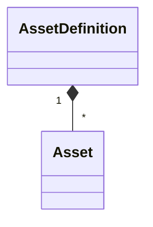
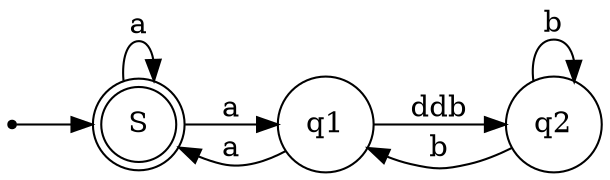

# 2018-08-09

## Investigate Markdown diagrams.

mermaid
PlantUML

StarUML can generate svgs but not from text sytax.

This morning investigated some markdown diagrams.  And if they work in docfx.


 ```mermaid
classDiagram
    Class01 <|-- AveryLongClass : Cool
    Class03 *-- Class04
    Class05 o-- Class06
    Class07 .. Class08
    Class09 --> C2 : Where am i?
    Class09 --* C3
    Class09 --|> Class07
    Class07 : equals()
    Class07 : Object[] elementData
    Class01 : size()
    Class01 : int chimp
    Class01 : int gorilla
    Class08 <--> C2: Cool label
```





## Finish up the Create AssetDefintion

I have the endpoint and yesterday added EF and Application Feature.

Worked on implementing the following:
## Api Features
GetApplication
GetAssetDefinition
CreateAssetDefinition

### Feature GetApplication
- [x] Implementation
  - [x] *Controller
  - [x] *Request
  - [x] *Response
  - [x] *Handler 
  - [x] Mapper 
  - [x] Validation (NA empty request)
- [x] Integration Tests
  - [x] Add Respawn to use with DB testing
  - [x] Add SliceFixture
  - [x] *Sunny Day Scenario
  - [x] *Validation Test (NA)
  - [ ] Negative Testing (Little value)
- [ ] Documentation
  - [ ] *Request class and properties
  - [ ] *Response class and properties

### Feature GetAssetDefinition

- [ ] Implementation
  - [x] *Controller
  - [x] *Request
  - [x] *Response
  - [x] *Handler 
  - [x] Mapper 
  - [ ] Validation
- [ ] Integration Tests
  - [ ] *Sunny Day Scenario
  - [ ] *Validation Test
  - [ ] Negative Testing
- [ ] Documentation
  - [ ] *Request class and properties
  - [ ] *Response class and properties

### Feature CreateAssetDefinition

- [ ] Implementation
  - [x] *Controller
  - [x] *Request
  - [x] *Response
  - [x] *Handler 
  - [x] Mapper 
  - [ ] Validation
- [ ] Integration Tests
  - [x] *Sunny Day Scenario
  - [ ] *Validation Test
  - [ ] Negative Testing
- [ ] Documentation
  - [ ] *Request class and properties
  - [ ] *Response class and properties